# Manga Translator — детекция пузырей/текста (YOLOv8) + OCR + перевод + редактирование

**Губанова Виталия**
**Stepik User ID: 1124167028**

Проект автоматически находит на страницах манги речевые пузыри и текст (YOLOv8), распознаёт текст внутри пузырей (OCR), переводит его на русский язык и позволяет отредактировать перевод перед сохранением готовой картинки.

## Содержание репозитория

```
manga-translator/
├── README.md                    # этот файл (отчёт + описание проекта)
├── weights/
│   └── best.pt                  # лучшие веса обученной модели YOLOv8n
├── training/
│   ├── Yolo_V.ipynb             # код подготовки датасета и обучения YOLO
│   ├── args.yaml                # полный конфиг обучения (гиперпараметры)
│   └── metrics/                 # логи и графики обучения
├── demo/
│   ├── Manga_otrisovka.ipynb    # код инференса: OCR → перевод → редактор → сохранение
│   └── demo_images/             # демонстрационные картинки манги (China / Korea)
├── docs/
│   └── report_images/           # иллюстрации из отчёта
└── data/
    └── README.md                # ссылка на размеченный датасет (Google Drive)
```

## Ссылка на датасет

Полный размеченный датасет (`Labeling.zip`, ~126 МБ) слишком велик для обычного git-репозитория и вынесен на Google Drive:
**https://drive.google.com/file/d/1a7WXl_SshpG62kNVQB_fQ_SN-hfJ64pe/view?usp=sharing**

(подробности — в [`data/README.md`](data/README.md))

---

## Отчёт о проделанной работе

Данные для обучения модели YOLO были подготовлены при помощи программы LabelImg. Были собраны 765 разных изображений в формате jpeg и помещены в папку `converted_images`. Разметка проводилась на два класса: 0 — пузырёк, 1 — текст. Текстовые файлы с информацией о YOLO-разметке находятся в папке `labels`. Ниже на рисунках даны примеры разметки.

<p>
  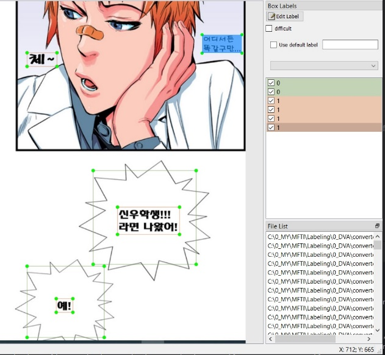
  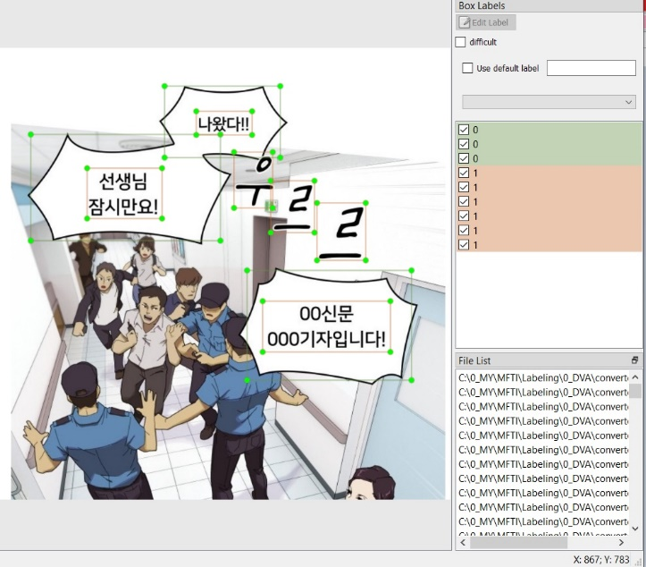
</p>
<p>
  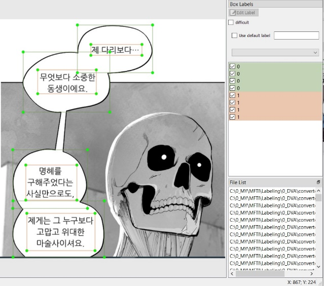
  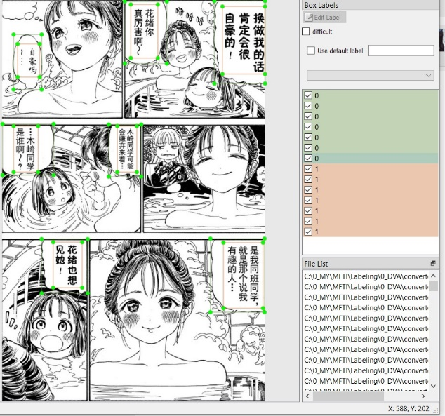
</p>
<p>
  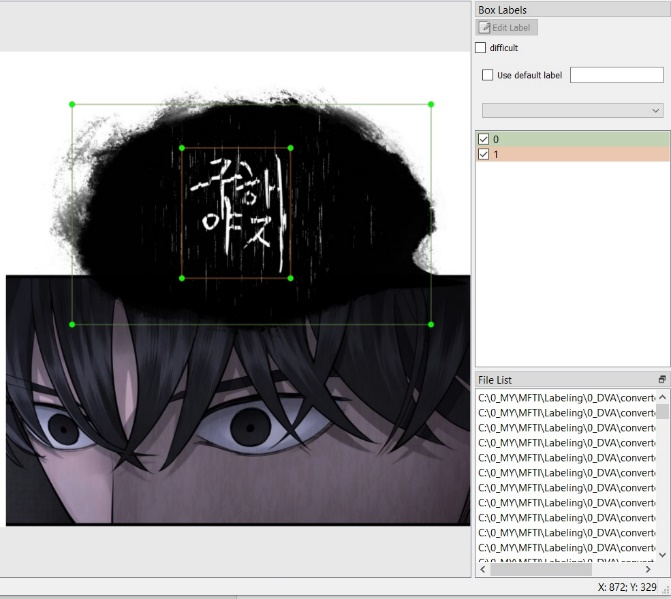
  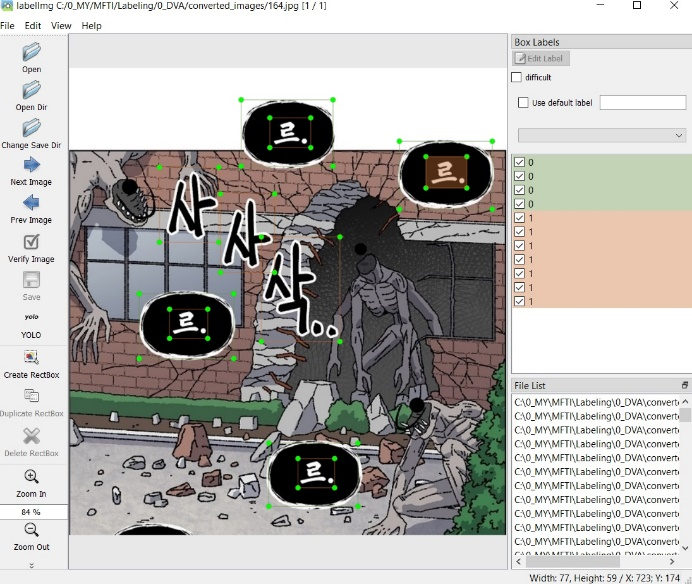
</p>

После того как разметка была закончена, две папки — `converted_images` и `labels` — были упакованы в zip-архив `Labeling.zip`.

Далее был создан код `Yolo_V.ipynb` для обучения модели YOLO на размеченных данных. Архив с рисунками и разметкой `Labeling.zip` нужно разместить в `/content/drive/MyDrive/Labeling.zip`. Для доступа к данному архиву в начале кода нужно подмонтировать `/content/drive`.

Обучение проводилось на GPU с батчем 16 примерно полчаса. В ходе обучения выводятся метрики на всех 80 эпохах.

<p>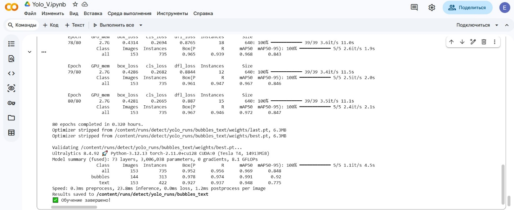</p>

Также сохраняется лучшая модель и последняя — `/content/runs/detect/yolo_runs/bubbles_text/weights/best.pt` и `/content/runs/detect/yolo_runs/bubbles_text/weights/last.pt`. Кроме того, лучшая модель сохраняется и в `/content/drive/MyDrive/best_yolo_model_V.pt`. Метрики и графики, полученные в ходе обучения, сохраняются в `/content/runs/detect/yolo_runs/bubbles_text/weights/`.

**Метрики итоговой модели (на валидации):**

| Класс | mAP@0.5 |
|---|---|
| bubbles | 0.991 |
| text | 0.948 |
| **все классы** | **0.969** |

- F1 (все классы) = **0.95** при confidence ≈ 0.624
- Precision (все классы) = **0.99** при confidence ≈ 0.899
- Recall (все классы) = **0.98** при confidence ≈ 0.000

Графики и confusion matrix — в [`training/metrics/`](training/metrics/): `results.png`, `BoxPR_curve.png`, `BoxF1_curve.png`, `BoxP_curve.png`, `BoxR_curve.png`, `confusion_matrix.png`, `confusion_matrix_normalized.png`, `labels.jpg`, `results.csv`.

Далее был создан код `Manga_otrisovka.ipynb`. Для работы этого кода нужна сохранённая в `/content/drive/MyDrive/best_yolo_model_V.pt` лучшая обученная YOLO-модель. И, кроме того, нужен также архив zip `MangaLangV`, который нужно расположить в `/content/drive/MyDrive/MangaLangV.zip`. Данный архив имеет структуру — `MangaLangV/MangaLang` и далее две папки — `China` и `Korea`. В этих папках находятся демонстрационные jpeg-картинки. В `China` — 5 картинок с мангой на китайском горизонтальном, а в `Korea` — 6 картинок в jpeg-формате с мангой на корейском языке. После запуска кода необходимо подтвердить доступ к Google MyDrive, и после этого появится строка, в которой надо ввести язык: 0 — Chinese (Simplified) или 1 — Korean. Нужно ввести 0 или 1 в строке и нажать Enter.

<p>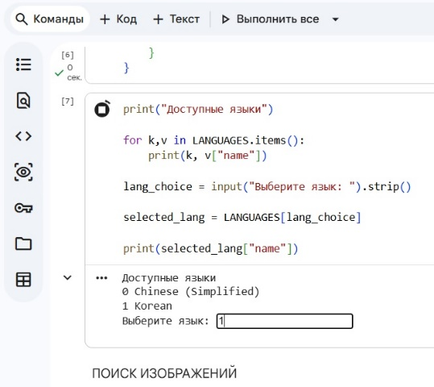</p>

После этого согласно выбранному варианту языка программа выберет соответствующую папку с демонстрационными картинками — либо `China`, либо `Korea`.

После этого обученная YOLO-модель пройдёт по всем соответствующим картинкам и найдёт все пузырьки и тексты. При этом будет создана структура `page`, в которой будет столько страниц с разметкой, сколько рисунков в соответствующей выбранному языку папке.

Далее для извлечения текста из текстовой области внутри пузырька на картинке использовался OCR — `easyocr` версии 1.7.2. Поскольку, как оказалось, OCR выделяет текст с ошибками, в коде предусмотрена обработка как изображения, так и текста. Но даже это не избавляет от большого количества ошибок, к сожалению. После работы OCR создаётся файл `ocr_result.json`, в котором содержится информация обо всех страницах-рисунках — координаты пузырьков, координаты текстов и соответствующих выделенных текстов.

Далее выделенные тексты переводились с помощью Google-переводчика — `from deep_translator import GoogleTranslator`. Результат работы переводчика сохранялся в файл `translated_result.json`, в котором к данным, описанным в `ocr_result.json`, добавляется поле с соответствующим переводом выделенного текста. Перевод осуществляется на русский язык.

Далее осуществляется цикл редактирования сделанного перевода. В начале предлагается ввести номер изображения, с которого вы желаете начать редактировать перевод. Допустим, есть 5 картинок манги, тогда если ввести цифру 1 и нажать Enter, то цикл пройдёт по всем картинкам от 1 до 5. И соответственно, если ввести, например, 4 и нажать Enter, то цикл редактирования пройдёт по картинкам с 4 по 5.

<p></p>

После того как начальный номер введён, появится окно, в котором слева будет оригинальная картинка, а справа — такая же, но уже с переводом. **Но возможно, что после выбора стартовой картинки нужно прокрутить код проекта до конца — именно в конце будут открываться редакционные окна.** Кроме того, будут отрисованы боксы для пузырьков и боксы для текста. Также на правой картинке будут выведены соответствующие ID для текстовых полей. И будут предложены варианты — редактировать картинку, сохранить как есть и закончить весь процесс редактирования. Надо нажать соответствующую кнопку. При сохранении картинки она сохраняется в `/content/translated_img_{lang_name}`, при этом на ней не будут отрисованы боксы для пузырьков и текста — будет чистая картинка с переводом.

<p>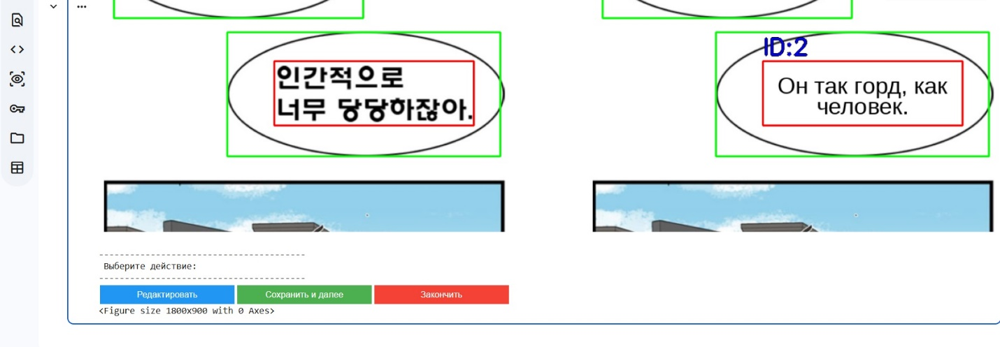</p>

Если выбрать вариант с редактированием, то появится строка, в которой нужно ввести номер того ID, текст которого мы хотим редактировать.

<p>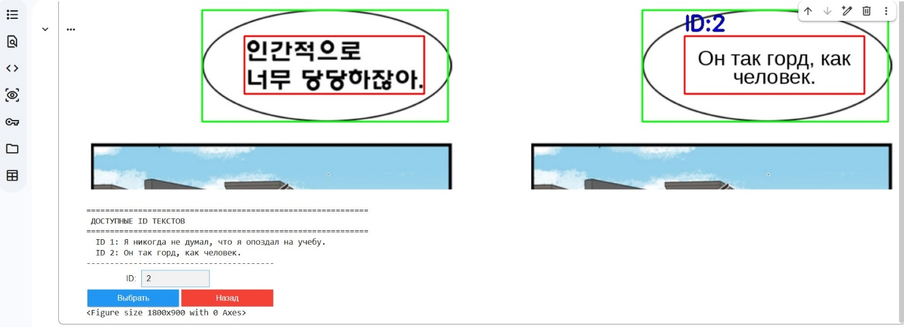</p>

После ввода нужного нам ID появится поле, в котором можно ввести желаемый редакционный текст.

<p>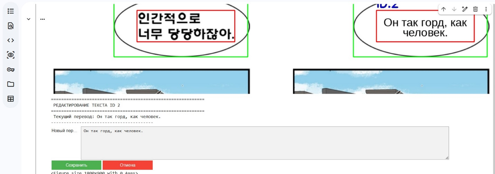</p>

Редактируем текст.

<p>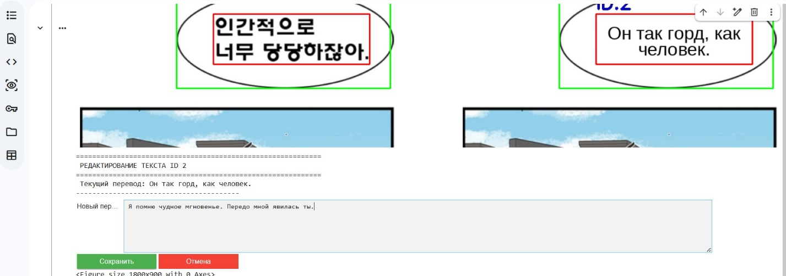</p>

В строке набрали редакционный текст и жмём Enter.

После ввода текста и нажатия Enter снова отрисуются две картинки, но на правой уже будет изображён отредактированный вариант.

<p>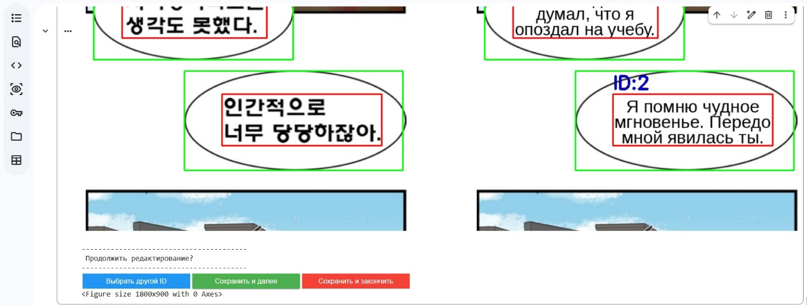</p>

После того как картинка отредактирована, её нужно сохранить. Как было сказано выше, она сохранится в jpeg-формате в `/content/translated_img_{lang_name}`. И так далее в цикле по всем оставшимся картинкам, либо жмём красную клавишу, чтоб оборвать цикл. После завершения цикла редактирования имеет смысл скачать нужные картинки из `/content/translated_img_{lang_name}` на свой компьютер, поскольку после завершения сеанса в Colab эти данные будут стёрты.

---

## Используемые библиотеки

`ultralytics` (YOLOv8) · `easyocr` · `deep-translator` (Google Translate) · `opencv-python` · `Pillow` · `ipywidgets` (интерактивный редактор в Colab) · `scikit-learn`

## Как воспроизвести

1. Скачать датасет по ссылке выше, положить в `/content/drive/MyDrive/Labeling.zip` (Google Colab).
2. Запустить `training/Yolo_V.ipynb` — обучится модель, веса появятся в `/content/runs/detect/yolo_runs/bubbles_text/weights/best.pt`.
3. Для демонстрации инференса — запустить `demo/Manga_otrisovka.ipynb`, указав путь к `best.pt` и к папке с демо-картинками (`demo/demo_images`, либо `MangaLangV.zip` на Google Drive, как в оригинальном коде).

> Повторное обучение не обязательно — в репозитории уже лежат готовые веса (`weights/best.pt`) и все метрики/графики обучения для ознакомления.
